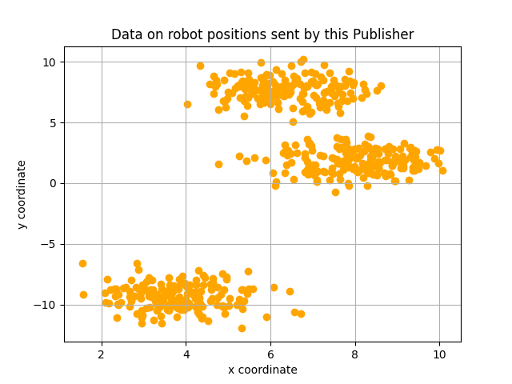

# Simple MQTT Publisher with Make Blobs

The present code solves two issues:

- It provides an example of how to connect to a MQTT broker and to publish a message.

- It illustrates how to generate data of robot positions, by using the SKlearn function
"Make Blobs".

The use of this code could be useful for transimitting the data on robot positions in an
IoT or Industry 4.0 settings. Once received by the subscribers, these data can be
then processed by Machine Learning techniques for clustering, to find the clusters of
robots. The used machine learning clustering techniques can be KMeans, hierarchical clustering, etc.

